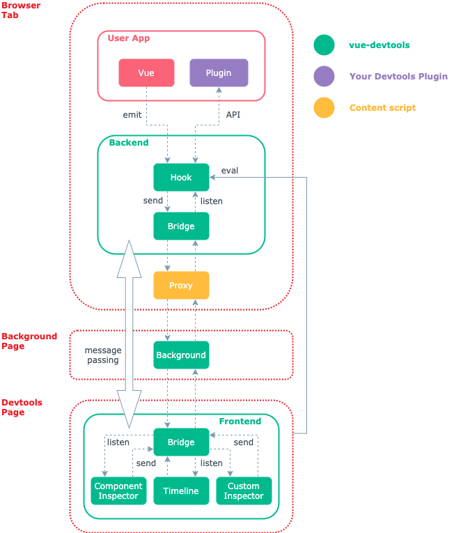
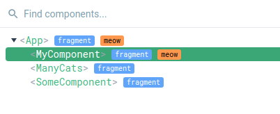
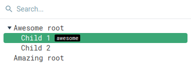
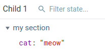
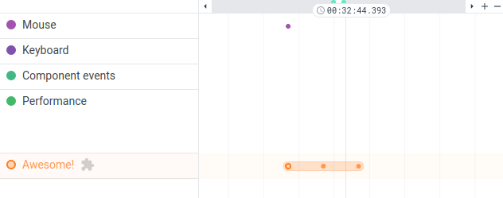
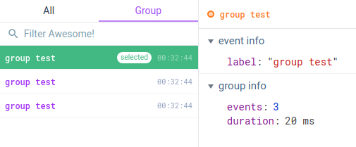
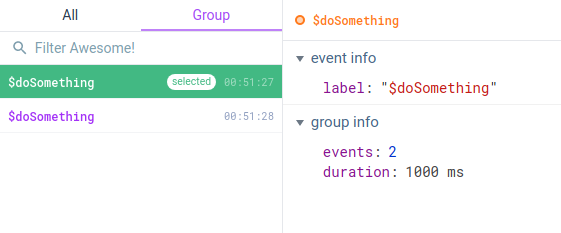

# Plugin Development Guide

::: warning Notice
The API is only available in Vue Devtools 6+
:::

## Architecture

A Vue Devtools Plugin is registered from your Vue package code in the user app. It interacts with the Vue Devtools Backend, *via* [the public API](./api-reference.md). The Backend is a script injected to the web page when the Vue Devtools are open by the user - it handles registering Vue applications and communicating with the Vue Devtools Frontend. The Frontend is the Vue application displayed in the browser devtools pane. The Hook is a global variable added to the page so that the Vue application and your plugin can send messages to the Backend.

There are 3 main API categories:
- **Components Inspector**: your plugin can add more information to the component tree and state.
- **Custom Inspectors**: you can add new inspectors to display any kind of state. For example: routes, store current state...
- **Timeline**: you can add custom layers and send events.

Using the API, you can show information to the user and improve the app debugging experience. Official libraries like `vue-router` and `vuex` already use this API!

### Architecture schema



## Setup

In your package, install `@vue/devtools-api` as a dependency:

```bash
yarn add @vue/devtools-api
```

This package will let you register a new Vue Devtools Plugin from your code and comes with full TypeScript typings.

Your `package.json` file should look similar to this:

```json
{
  "name": "my-awesome-plugin",
  "version": "0.0.0",
  "main": "dist/index.js",
  "dependencies": {
    "@vue/devtools-api": "^6.0.0-beta.14"
  },
  "peerDependencies": {
    "vue": "^3.1.0"
  },
  "devDependencies": {
    "vue": "^3.1.0"
  }
}
```

It's a good idea to also specify `vue` as a peer dependency to inform the user which version of Vue your package is compatible with.

### TypeScript

If you are using TS, your `package.json` file should look similar to this:

```json
{
  "name": "my-awesome-plugin",
  "version": "0.0.0",
  "main": "dist/index.js",
  "scripts": {
    "dev": "tsc --watch -d",
    "build": "tsc -d"
  },
  "dependencies": {
    "@vue/devtools-api": "^6.0.0-beta.14"
  },
  "peerDependencies": {
    "vue": "^3.1.0"
  },
  "devDependencies": {
    "@types/node": "^14.14.22",
    "typescript": "^4.1.3",
    "vue": "^3.1.0"
  }
}
```

Here is an example `tsconfig.json` file to put next to the `package.json` file:

```json
{
  "include": [
    "src/global.d.ts",
    "src/**/*.ts",
    "__tests__/**/*.ts"
  ],
  "compilerOptions": {
    "outDir": "dist",
    "sourceMap": false,

    "target": "esnext",
    "module": "esnext",
    "moduleResolution": "node",
    "allowJs": false,
    "skipLibCheck": true,

    "noUnusedLocals": true,
    "strictNullChecks": true,
    "noImplicitAny": true,
    "noImplicitThis": true,
    "noImplicitReturns": false,
    "strict": true,
    "isolatedModules": true,

    "experimentalDecorators": true,
    "resolveJsonModule": true,
    "esModuleInterop": true,
    "removeComments": false,
    "jsx": "preserve",
    "lib": [
      "esnext",
      "dom"
    ],
    "types": [
      "node"
    ]
  }
}
```

### Rollup

[Rollup](https://rollupjs.org/) is a general-purpose bundler. You can use it to compile your package for easier consumption. It's also very handy if you have `.vue` files to compile!

```bash
yarn add -D rollup rollup-plugin-vue @rollup/plugin-commonjs @rollup/plugin-node-resolve @rollup/plugin-replace rollup-plugin-terser pascalcase rimraf
```

::: tip Notice about the packages
- `rollup-plugin-vue` compiles the `.vue` files.
- `@rollup/plugin-commonjs` converts CommonJS modules to ES2015 modules.
- `@rollup/plugin-node-resolve` locates and bundles third-party dependencies in `node_modules`.
- `@rollup/plugin-replace` allow us to replace some source code text like `process.env.NODE_ENV` with the values we want at build time.
- `rollup-plugin-terser` minimizes the output for production.
- `pascalcase` is used to convert your package name (from `package.json`) into Pascal case, for example `my-plugin` to `MyPlugin`.
- `rimraf` is useful to clear the `dist` folder before building.
:::

#### Rollup config

Create a `rollup.config.js` file next to the `package.json` file:

```js
import vuePlugin from 'rollup-plugin-vue'
import replace from '@rollup/plugin-replace'
import resolve from '@rollup/plugin-node-resolve'
import commonjs from '@rollup/plugin-commonjs'
import pascalcase from 'pascalcase'

const pkg = require('./package.json')
const name = pkg.name

function getAuthors (pkg) {
  const { contributors, author } = pkg

  const authors = new Set()
  if (contributors && contributors) {
    contributors.forEach((contributor) => {
      authors.add(contributor.name)
    })
  }
  if (author) authors.add(author.name)

  return Array.from(authors).join(', ')
}

const banner = `/*!
  * ${pkg.name} v${pkg.version}
  * (c) ${new Date().getFullYear()} ${getAuthors(pkg)}
  * @license MIT
  */`

const outputConfigs = {
  // each file name has the format: `dist/${name}.${format}.js`
  // format being a key of this object
  'esm-bundler': {
    file: pkg.module,
    format: 'es'
  },
  cjs: {
    file: pkg.main,
    format: 'cjs'
  },
  global: {
    file: pkg.unpkg,
    format: 'iife'
  },
  esm: {
    file: pkg.module.replace('bundler', 'browser'),
    format: 'es'
  }
}

const allFormats = Object.keys(outputConfigs)
const packageFormats = allFormats
const packageConfigs = packageFormats.map((format) =>
  createConfig(format, outputConfigs[format])
)

// only add the production ready if we are bundling the options
packageFormats.forEach((format) => {
  if (format === 'cjs') {
    packageConfigs.push(createProductionConfig(format))
  } else if (format === 'global') {
    packageConfigs.push(createMinifiedConfig(format))
  }
})

export default packageConfigs

function createConfig (format, output, plugins = []) {
  if (!output) {
    console.log(`invalid format: "${format}"`)
    process.exit(1)
  }

  output.sourcemap = !!process.env.SOURCE_MAP
  output.banner = banner
  output.externalLiveBindings = false
  output.globals = { vue: 'Vue', '@vue/composition-api': 'vueCompositionApi' }

  const isProductionBuild = /\.prod\.js$/.test(output.file)
  const isGlobalBuild = format === 'global'
  const isRawESMBuild = format === 'esm'
  const isNodeBuild = format === 'cjs'
  const isBundlerESMBuild = /esm-bundler/.test(format)

  if (isGlobalBuild) output.name = pascalcase(pkg.name)

  const external = ['vue', '@vue/composition-api']
  if (!isGlobalBuild) {
    external.push('@vue/devtools-api')
  }

  const nodePlugins = [resolve(), commonjs()]

  return {
    input: 'src/index.ts',
    // Global and Browser ESM builds inlines everything so that they can be
    // used alone.
    external,
    plugins: [
      vuePlugin(),
      createReplacePlugin(
        isProductionBuild,
        isBundlerESMBuild
      ),
      ...nodePlugins,
      ...plugins
    ],
    output
  }
}

function createReplacePlugin (
  isProduction,
  isBundlerESMBuild
) {
  const replacements = {
    'process.env.NODE_ENV': isBundlerESMBuild
      ? // preserve to be handled by bundlers
      'process.env.NODE_ENV'
      : // hard coded dev/prod builds
      JSON.stringify(isProduction ? 'production' : 'development'),
    __VUE_PROD_DEVTOOLS__: isBundlerESMBuild
      ? '__VUE_PROD_DEVTOOLS__'
      : 'false'
  }
  // allow inline overrides like
  // __RUNTIME_COMPILE__=true yarn build
  Object.keys(replacements).forEach((key) => {
    if (key in process.env) {
      replacements[key] = process.env[key]
    }
  })
  return replace({
    preventAssignment: true,
    values: replacements
  })
}

function createProductionConfig (format) {
  return createConfig(format, {
    file: `dist/${name}.${format}.prod.js`,
    format: outputConfigs[format].format
  })
}

function createMinifiedConfig (format) {
  const { terser } = require('rollup-plugin-terser')
  return createConfig(
    format,
    {
      file: `dist/${name}.${format}.prod.js`,
      format: outputConfigs[format].format
    },
    [
      terser({
        module: /^esm/.test(format),
        compress: {
          ecma: 2015,
          pure_getters: true
        }
      })
    ]
  )
}
```

#### Rollup package

Add the main fields, `exports` and `scripts` to your `package.json`:

```json
{
  "name": "my-plugin",
  "version": "0.0.0",
  "description": "A demo Vue 3 plugin with devtools integration",
  "author": {
    "name": "Guillaume Chau",
    "email": "guillaume.b.chau@gmail.com"
  },
  "main": "dist/my-plugin.cjs.js",
  "module": "dist/my-plugin.esm-bundler.js",
  "unpkg": "dist/my-plugin.global.js",
  "jsdelivr": "dist/my-plugin.global.js",
  "exports": {
    ".": {
      "require": "./dist/my-plugin.cjs.js",
      "browser": "./dist/my-plugin.esm-browser.js",
      "import": "./dist/my-plugin.esm-bundler.js",
      "module": "./dist/my-plugin.esm-bundler.js"
    },
    "./package.json": "./package.json"
  },
  "sideEffects": false,
  "scripts": {
    "build": "rimraf dist && rollup -c rollup.config.js"
  }
  ...
}
```

Don't forget to replace `my-plugin` with your package name.

You can now use the `build` script to compile the package:

```bash
yarn build
```

#### Rollup with TypeScript

Install the Rollup TS plugin:

```bash
yarn add -D rollup-plugin-typescript2
```

Modify the Rollup config to compile the TS files:

```js{1,3,32-33,92-110,126}
import path from 'path'
import vuePlugin from 'rollup-plugin-vue'
import ts from 'rollup-plugin-typescript2'
import replace from '@rollup/plugin-replace'
import resolve from '@rollup/plugin-node-resolve'
import commonjs from '@rollup/plugin-commonjs'
import pascalcase from 'pascalcase'

const pkg = require('./package.json')
const name = pkg.name

function getAuthors (pkg) {
  const { contributors, author } = pkg

  const authors = new Set()
  if (contributors && contributors) {
    contributors.forEach((contributor) => {
      authors.add(contributor.name)
    })
  }
  if (author) authors.add(author.name)

  return Array.from(authors).join(', ')
}

const banner = `/*!
  * ${pkg.name} v${pkg.version}
  * (c) ${new Date().getFullYear()} ${getAuthors(pkg)}
  * @license MIT
  */`

// ensure TS checks only once for each build
let hasTSChecked = false

const outputConfigs = {
  // each file name has the format: `dist/${name}.${format}.js`
  // format being a key of this object
  'esm-bundler': {
    file: pkg.module,
    format: 'es'
  },
  cjs: {
    file: pkg.main,
    format: 'cjs'
  },
  global: {
    file: pkg.unpkg,
    format: 'iife'
  },
  esm: {
    file: pkg.module.replace('bundler', 'browser'),
    format: 'es'
  }
}

const allFormats = Object.keys(outputConfigs)
const packageFormats = allFormats
const packageConfigs = packageFormats.map((format) =>
  createConfig(format, outputConfigs[format])
)

// only add the production ready if we are bundling the options
packageFormats.forEach((format) => {
  if (format === 'cjs') {
    packageConfigs.push(createProductionConfig(format))
  } else if (format === 'global') {
    packageConfigs.push(createMinifiedConfig(format))
  }
})

export default packageConfigs

function createConfig (format, output, plugins = []) {
  if (!output) {
    console.log(`invalid format: "${format}"`)
    process.exit(1)
  }

  output.sourcemap = !!process.env.SOURCE_MAP
  output.banner = banner
  output.externalLiveBindings = false
  output.globals = { vue: 'Vue', '@vue/composition-api': 'vueCompositionApi' }

  const isProductionBuild = /\.prod\.js$/.test(output.file)
  const isGlobalBuild = format === 'global'
  const isRawESMBuild = format === 'esm'
  const isNodeBuild = format === 'cjs'
  const isBundlerESMBuild = /esm-bundler/.test(format)

  if (isGlobalBuild) output.name = pascalcase(pkg.name)

  const shouldEmitDeclarations = !hasTSChecked

  const tsPlugin = ts({
    check: !hasTSChecked,
    tsconfig: path.resolve(__dirname, 'tsconfig.json'),
    cacheRoot: path.resolve(__dirname, 'node_modules/.rts2_cache'),
    tsconfigOverride: {
      compilerOptions: {
        sourceMap: output.sourcemap,
        declaration: shouldEmitDeclarations,
        declarationMap: shouldEmitDeclarations
      },
      exclude: ['__tests__', 'test-dts']
    }
  })
  // we only need to check TS and generate declarations once for each build.
  // it also seems to run into weird issues when checking multiple times
  // during a single build.
  hasTSChecked = true

  const external = ['vue', '@vue/composition-api']
  if (!isGlobalBuild) {
    external.push('@vue/devtools-api')
  }

  const nodePlugins = [resolve(), commonjs()]

  return {
    input: 'src/index.ts',
    // Global and Browser ESM builds inlines everything so that they can be
    // used alone.
    external,
    plugins: [
      vuePlugin(),
      tsPlugin,
      createReplacePlugin(
        isProductionBuild,
        isBundlerESMBuild
      ),
      ...nodePlugins,
      ...plugins
    ],
    output
  }
}

function createReplacePlugin (
  isProduction,
  isBundlerESMBuild
) {
  const replacements = {
    'process.env.NODE_ENV': isBundlerESMBuild
      ? // preserve to be handled by bundlers
      'process.env.NODE_ENV'
      : // hard coded dev/prod builds
      JSON.stringify(isProduction ? 'production' : 'development'),
    __VUE_PROD_DEVTOOLS__: isBundlerESMBuild
      ? '__VUE_PROD_DEVTOOLS__'
      : 'false'
  }
  // allow inline overrides like
  // __RUNTIME_COMPILE__=true yarn build
  Object.keys(replacements).forEach((key) => {
    if (key in process.env) {
      replacements[key] = process.env[key]
    }
  })
  return replace({
    preventAssignment: true,
    values: replacements
  })
}

function createProductionConfig (format) {
  return createConfig(format, {
    file: `dist/${name}.${format}.prod.js`,
    format: outputConfigs[format].format
  })
}

function createMinifiedConfig (format) {
  const { terser } = require('rollup-plugin-terser')
  return createConfig(
    format,
    {
      file: `dist/${name}.${format}.prod.js`,
      format: outputConfigs[format].format
    },
    [
      terser({
        module: /^esm/.test(format),
        compress: {
          ecma: 2015,
          pure_getters: true
        }
      })
    ]
  )
}
```

And add the `types` field to your `package.json` file:

```json{13}
{
  "name": "my-plugin",
  "version": "0.0.0",
  "description": "A demo Vue 3 plugin with devtools integration",
  "author": {
    "name": "Guillaume Chau",
    "email": "guillaume.b.chau@gmail.com"
  },
  "main": "dist/my-plugin.cjs.js",
  "module": "dist/my-plugin.esm-bundler.js",
  "unpkg": "dist/my-plugin.global.js",
  "jsdelivr": "dist/my-plugin.global.js",
  "types": "dist/index.d.ts",
  "exports": {
    ".": {
      "require": "./dist/my-plugin.cjs.js",
      "browser": "./dist/my-plugin.esm-browser.js",
      "import": "./dist/my-plugin.esm-bundler.js",
      "module": "./dist/my-plugin.esm-bundler.js"
    },
    "./package.json": "./package.json"
  },
  "sideEffects": false,
  "scripts": {
    "build": "rimraf dist && rollup -c rollup.config.js"
  }
  ...
}
```

See [TypeScript](#typescript) for a `tsconfig.json` example.


<!--
### esbuild

[esbuild](https://esbuild.github.io) is a very fast JavaScript/TypeScript compiler & bundler.

```bash
yarn add -D esbuild esbuild-plugin-vue @vue/compiler-sfc
```

```js
const esbuild = require('esbuild')
const vue = require('esbuild-plugin-vue').default

const pkgName = 'my-plugin'

/** @type {import('esbuild').BuildOptions} */
const commonOptions = {
  entryPoints: ['./src/index.ts'],
  bundle: true,
  sourcemap: true,
  external: [
    'vue',
    // Add libraries to exclude from bundling for browser builds
  ],
  target: 'es6', // Change to the targets you want
  plugins: [
    vue()
  ]
}

// ESM Bundler
esbuild.build({
  ...commonOptions,
  outfile: `dist/${pkgName}.esm-bundler.js`,
  format: 'esm',
  platform: 'node',
  external: [
    // Mark all dependencies as external
    ...Object.keys(require('./package.json').dependencies),
    ...Object.keys(require('./package.json').peerDependencies),
  ],
})

// Browser dev
esbuild.build({
  ...commonOptions,
  outfile: `dist/${pkgName}.browser.js`,
  format: 'iife',
  platform: 'browser',
  define: {
    'process.env.NODE_ENV': JSON.stringify('development'),
    '__VUE_PROD_DEVTOOLS__': JSON.stringify(process.env.__VUE_PROD_DEVTOOLS__ || false),
  },
})

// Browser prod
esbuild.build({
  ...commonOptions,
  outfile: `dist/${pkgName}.browser.min.js`,
  format: 'iife',
  platform: 'browser',
  define: {
    'process.env.NODE_ENV': JSON.stringify('production'),
    '__VUE_PROD_DEVTOOLS__': JSON.stringify(process.env.__VUE_PROD_DEVTOOLS__ || false),
  },
  minify: true,
})
```

```json
{
  "name": "my-awesome-plugin",
  "version": "0.0.0",
  "main": "dist/my-plugin.browser.min.js",
  "module": "dist/my-plugin.esm-bundler.js",
  "types": "dist/index.d.ts",
  "scripts": {
    "dev": "tsc --watch -d",
    "build": "tsc -d --emitDeclarationOnly && node ./esbuild.js"
  },
  "dependencies": {
    "@vue/devtools-api": "^6.0.0-beta.14"
  },
  "peerDependencies": {
    "vue": "^3.0.5"
  },
  "devDependencies": {
    "@types/node": "^14.14.22",
    "@vue/compiler-sfc": "^3.1.2",
    "esbuild": "^0.12.9",
    "esbuild-plugin-vue": "^0.1.2",
    "typescript": "^4.1.3",
    "vue": "^3.0.5"
  }
}
```

@TODO
-->

## Registering your plugin

Create a new `devtools.js` file in your source folder.

### Plugin setup

We are going to import [`setupDevtoolsPlugin`](./api-reference.md#setupdevtoolsplugin) from the `@vue/devtools-api` package:

```js
import { setupDevtoolsPlugin } from '@vue/devtools-api'
```

Then we export a function to setup our Vue Devtools plugin:

```js
export function setupDevtools () {
  setupDevtoolsPlugin({ /* Options... */}, api => {
    // Logic...
  })
}
```

Add the plugin options in the first argument:

```js{2-5}
setupDevtoolsPlugin({
  id: 'my-awesome-devtools-plugin',
  label: 'My Awesome Plugin',
  packageName: 'my-awesome-plugin',
  homepage: 'https://vuejs.org'
}, api => {
  // Logic...
})
```

Every plugin is bound to a Vue application. You need to pass the user application to `setupDevtoolsPlugin` - the same that your plugin `install` method gets as the first argument.

```js{1,7}
export function setupDevtools (app) {
  setupDevtoolsPlugin({
    id: 'my-awesome-devtools-plugin',
    label: 'My Awesome Plugin',
    packageName: 'my-awesome-plugin',
    homepage: 'https://vuejs.org',
    app
  }, api => {
    // Logic...
  })
}
```

The second argument of `setupDevtoolsPlugin` is a callback which will get the Vue Devtools API as the first argument:

```js{5-7}
export function setupDevtools (app) {
  setupDevtoolsPlugin({
    id: 'my-awesome-devtools-plugin',
    // ...
  }, api => {
    // Use the API here...
  })
}
```

We can now import and use our `setupDevtools` function in our Vue plugin:

```js
import { setupDevtools } from './devtools'

export default {
  install (app, options = {}) {
    // Our Vue plugin logic

    setupDevtools(app)
  }
}
```

### Tree-shaking for production

As we are going to write code only for integrating for the Vue Devtools, it would be a good idea to strip it for the production versions of our package - thus improving size and performance.

By default, Vue 3 doesn't include the devtools-related code in production. [It uses](https://github.com/vuejs/vue-next/tree/master/packages/vue#bundler-build-feature-flags) the `__VUE_PROD_DEVTOOLS__` environment variable as a compile flag to force enable this code. We can use the same one for the same purpose, and we can also check for `NODE_ENV` to automatically include the devtools plugin in development.

```js
if (process.env.NODE_ENV === 'development' || __VUE_PROD_DEVTOOLS__) {
  setupDevtools(app)
}
```

In your build setup you should replace `process.env.NODE_ENV` and `__VUE_PROD_DEVTOOLS__` for the builds of your library that don't target bundlers. See [Rollup setup](#rollup) that includes an example usage of `@rollup/plugin-replace`.

## Components

The Components API allows you to:

- Add tags to the components tree.
- Display additional data in the component state inspector.

### Hooks

The Vue Devtools API includes **Hooks** which are available *via* `api.on`. Hooks are useful to add new debugging information to existing elements, such as components tree nodes, component state, timeline events... A new callback for a specific hook can be registered with `api.on.hookName(callback)`.

Every hook expects the callback function to have those same arguments:
- `payload` which holds the state related to the hook. It can be modified to pass back additional information.
- `context` exposing data about the devtools

Example:

```js{6-8}
export function setupDevtools (app) {
  setupDevtoolsPlugin({
    id: 'my-awesome-devtools-plugin',
    // ...
  }, api => {
    api.on.hookNameHere((payload, context) => {
      // Do something...
    })
  })
}
```

Every hook handle asynchronous callbacks:

```js{6-8}
export function setupDevtools (app) {
  setupDevtoolsPlugin({
    id: 'my-awesome-devtools-plugin',
    // ...
  }, api => {
    api.on.hookNameHere(async (payload, context) => {
      await something()
    })
  })
}
```

All the registered callbacks will be called sequentially including the asynchronous ones, in the order they were registered on the page.

### Components tree

To add tags to the components tree, we can use the [`visitComponentTree`](./api-reference.md#on-visitcomponenttree) hook:

```js{6-14}
export function setupDevtools (app) {
  setupDevtoolsPlugin({
    id: 'my-awesome-devtools-plugin',
    // ...
  }, api => {
    api.on.visitComponentTree((payload, context) => {
      if (payload.componentInstance.type.meow) {
        node.tags.push({
          label: 'meow',
          textColor: 0x000000,
          backgroundColor: 0xff984f
        })
      }
    })
  })
}
```

This example will add a `meow` tag to any component that add the `meow: true` option to its definition:

```js
export default {
  meow: true
}
```

Here is an example result:



### Colors

Colors in the Vue Devtools API are encoded as numbers instead of strings. You can use `0x` in JavaScript to write an hexadecimal value:

```js
0x000000 // black
0xffffff // white
0xff984f // orange
0x41b86a // green
```

Example:

```js{6-7}
api.on.visitComponentTree((payload, context) => {
  const node = payload.treeNode
  if (payload.componentInstance.type.meow) {
    node.tags.push({
      label: 'meow',
      textColor: 0x000000,
      backgroundColor: 0xff984f
    })
  }
})
```

### Notify a change

By default the Vue Devtools will determine when to update the components tree (and thus calling the hook again). We can force a refresh with the [`api.notifyComponentUpdate`](./api-reference.md#notifycomponentupdate) function:

```js
api.notifyComponentUpdate(componentInstance)
```

That way, if we know that the tags of a specific component should be changed, we can notify the Vue Devtools and then our hook callback will be called again.

### Component state

Adding new data to the component state inspector can be achieved with the [`inspectComponent`](./api-reference.md#on-inspectcomponent) hook:

```js
api.on.inspectComponent((payload, context) => {
  // ...
})
```

Each new field should be added to the `payload.instanceData.state` array:

```js{2-6,8-12}
api.on.inspectComponent((payload, context) => {
  payload.instanceData.state.push({
    type: 'My Awesome Plugin state',
    key: '$hello',
    value: data.message
  })

  payload.instanceData.state.push({
    type: 'My Awesome Plugin state',
    key: 'time counter',
    value: data.counter
  })
})
```

Notice how we are passing some data to the Vue Devtools plugin from our library with the `data` argument of `setupDevtools` (see below).

The `type` will be used to create a new section in the state inspector. It is recommended to use a variable:

```js{1,10,16}
const stateType = 'My Awesome Plugin state'

export function setupDevtools (app, data) {
  setupDevtoolsPlugin({
    id: 'my-awesome-devtools-plugin',
    // ...
  }, api => {
    api.on.inspectComponent((payload, context) => {
      payload.instanceData.state.push({
        type: stateType,
        key: '$hello',
        value: data.message
      })

      payload.instanceData.state.push({
        type: stateType,
        key: 'time counter',
        value: data.counter
      })
    })
  })
}
```

Then, use this variable to declare your data type in the Vue Devtools plugin options using `componentStateTypes`:

```js{7-9}
export function setupDevtools (app) {
  setupDevtoolsPlugin({
    id: 'my-awesome-devtools-plugin',
    label: 'My Awesome Plugin',
    packageName: 'my-awesome-plugin',
    homepage: 'https://vuejs.org',
    componentStateTypes: [
      stateType
    ],
    app
  }, api => {
    // ...
  })
}
```

Here is an example result:


You can again use `notifyComponentUpdate` to force a state refresh of the current component if you don't pass any argument:

```js
api.notifyComponentUpdate()
```

### Editing component state

You can mark some of your state fields as `editable` to allow editing by the user:

```js
payload.instanceData.state.push({
  type: stateType,
  key: '$hello',
  value: data.message,
  editable: true
})
```

You can then handle the edition submit with the [`editComponentState`](./api-reference.md#on-editcomponentstate) hook:

```js
api.on.editComponentState(payload => {
  // ...
})
```

Then, you have to check if the field being edited is coming from your plugin with `payload.type`:

```js{2}
api.on.editComponentState(payload => {
  if (payload.type === stateType) {
    // ...
  }
})
```

This way we don't do anything if the user is editing something else (like data properties).

An edited field can be modified in the following ways:

- assigning a new value,
- adding a new property (object) or item (array),
- removing a property or item.

You can then use the `payload.set` helper function to apply the edition. The argument to `payload.set` should be the object holding our editable state:

```js{3}
api.on.editComponentState(payload => {
  if (payload.type === stateType) {
    payload.set(data)
  }
})
```

In this example, we execute `payload.set(data)` because we are sending the `data.message` editable state:

```js{4}
payload.instanceData.state.push({
  type: stateType,
  key: '$hello',
  value: data.message,
  editable: true
})
```

You can also use a separate object to hold your editable state ([example](./api-reference.md#on-editcomponentstate)).

## Custom inspector

The Vue Devtools only have one inspector by default: the Components inspector. Vue Devtools plugins can introduce new inspectors alongside it to display more debugging information.

To setup a custom inspector, your plugin must:

1. Register the custom inspector with `addInspector`.
2. Handle the `getInspectorTree` hook to populate the inspector tree (on the left or top of the devtools).
3. Handle the `getInspectorState` hook to send state (on the right or bottom of the devtools).

### Register the custom inspector

Let's start by regiustering our custom inspector with [`addInspector`](./api-reference.md#addinspector):

```js
api.addInspector({
  id: 'my-awesome-plugin',
  label: 'Awesome!',
  icon: 'pets',
})
```

It is recommended to use a variable to store the inspector id as it will be needed in the hooks later:

```js{1,9}
const inspectorId = 'my-awesome-plugin'

export function setupDevtools (app, data) {
  setupDevtoolsPlugin({
    id: 'my-awesome-devtools-plugin',
    // ...
  }, api => {
    api.addInspector({
      id: inspectorId,
      label: 'Awesome!',
      icon: 'pets',
    })
  })
}
```

You can use any [Material Icon](https://fonts.google.com/icons) code for the icon, for example `note_add` or `drag_indicator`.

Here is an example result:


### Send inspector tree

With the [`getInspectorTree`](./api-reference.md#on-getinspectortree), we can display a tree of nodes in our inspector:

```js
api.on.getInspectorTree((payload, context) => {
  // ...
})
```

But before that, we need to check if hook is called for the correct inspector (ours):

```js{2}
api.on.getInspectorTree((payload, context) => {
  if (payload.inspectorId === inspectorId) {
    // ...
  }
})
```

We can then put the nodes tree into `payload.rootNodes`:

```js{3-29}
api.on.getInspectorTree((payload, context) => {
  if (payload.inspectorId === inspectorId) {
    payload.rootNodes = [
      {
        id: 'root',
        label: 'Awesome root',
        children: [
          {
            id: 'child-1',
            label: 'Child 1',
            tags: [
              {
                label: 'awesome',
                textColor: 0xffffff,
                backgroundColor: 0x000000
              }
            ]
          },
          {
            id: 'child-2',
            label: 'Child 2'
          }
        ]
      },
      {
        id: 'root2',
        label: 'Amazing root'
      }
    ]
  }
})
```

Here is an example result:



### Send the inspector state

Use the [`getInspectorState`](./api-reference.md#on-getinspectorstate) hook to send the state depending on the selected node (check `payload.nodeId`):

```js
api.on.getInspectorState((payload, context) => {
  if (payload.inspectorId === inspectorId) {
    if (payload.nodeId === 'child-1') {
      payload.state = {
        'my section': [
          {
            key: 'cat',
            value: 'meow',
          }
        ]
      }
    } else if (payload.nodeId === 'child-2') {
      payload.state = {
        'my section': [
          {
            key: 'dog',
            value: 'waf',
          }
        ]
      }
    }
  }
})
```

Don't forget to check if the inspector is the right one with `payload.inspectorId`!

Here is an example result when selecting "Child 1":



### Refresh the inspector

The Vue Devtools will not automatically refresh your custom inspector. To send updates, you have two different available functions:

- [`sendInspectorTree`](./api-reference.md#sendinspectortree) to refresh the nodes tree,
- [`sendInspectorState`](./api-reference.md#sendinspectorstate) to refersh the state inspector.

Example:

```js
// Update tree
api.sendInspectorTree(inspectorId)

// Update state
api.sendInspectorState(inspectorId)
```

Calling those functions will call the `getInspectorTree` and `getInspectorState` hooks respectively.

## Timeline

The Vue Devtools comes with a few built-in layers on the Timeline, such as the Mouse & Keyboard events, the Component events and the Performance flamechart. You can add custom Timeline layers with the following steps:

1. Register the layer with `addTimelineLayer`.
2. Send events with `addTimelineEvent`.

### Register a layer

Use the [`addTimelineLayer`](./api-reference.md#addtimelinelayer) function to register your custom Timeline layer:

```js{1,8-12}
const timelineLayerId = 'my-awesome-plugin'

export function setupDevtools (app, data) {
  setupDevtoolsPlugin({
    id: 'my-awesome-devtools-plugin',
    // ...
  }, api => {
    api.addTimelineLayer({
      id: timelineLayerId,
      color: 0xff984f,
      label: 'Awesome!'
    })
  })
}
```

Here is an example result:


### Send an event

Adding new events is done with the [`addTimelineEvent`](./api-reference.md#addtimelineevent) function:

```js{2-11}
window.addEventListener('click', event => {
  api.addTimelineEvent({
    layerId: timelineLayerId,
    event: {
      time: Date.now(),
      data: {
        mouseX: event.clientX,
        mouseY: event.clientY
      }
    }
  })
})
```

### Event group

You can group events together. It will display them inside a pill-shaped rectangle, and will display the total duration of the group in the event inspector.

Set the `groupId` option on the `event` with an identical value to create a group. Here is an example of a group with 3 events:

```js
const groupId = 'group-1'

devtoolsApi.addTimelineEvent({
  layerId: timelineLayerId,
  event: {
    time: Date.now(),
    data: {
      label: 'group test'
    },
    title: 'group test',
    groupId
  }
})

devtoolsApi.addTimelineEvent({
  layerId: timelineLayerId,
  event: {
    time: Date.now() + 10,
    data: {
      label: 'group test (event 2)',
    },
    title: 'group test',
    groupId
  }
})

devtoolsApi.addTimelineEvent({
  layerId: timelineLayerId,
  event: {
    time: Date.now() + 20,
    data: {
      label: 'group test (event 3)',
    },
    title: 'group test',
    groupId
  }
})
```

Here is the result on the timeline with the first event of the group selected:



And the event inspector view with the "Group" tab:



Notice the "group info" section with additional information about the group.

### Events from the package

Let's use the `addTimelineEvent` API to track an asynchronous method expose by our Vue plugin. We will call it `$doSomething`:

```js{5-15}
import { setupDevtools } from './devtools'

export default {
  install (app, options = {}) {
    app.mixin({
      methods: {
        $doSomething () {
          return new Promise(resolve => {
            setTimeout(() => {
              resolve('done')
            }, 1000)
          })
        }
      }
    })

    if (process.env.NODE_ENV === 'development' || __VUE_PROD_DEVTOOLS__) {
      setupDevtools(app, data)
    }
  }
}
```

We can now call this method from any component in the user application:

```js
this.$doSomething()
```

We would like to track this method from our library code, so we need to return a set of helper functions from our `setupDevtools` function. The `devtoolsApi` variable will hold the Vue Devtools API and the `devtools` variable will be an object with helper functions, which we will return:

```js{2,4-6,12,17}
export function setupDevtools (app, data) {
  let devtoolsApi

  const devtools = {
    // Our helpers here
  }

  setupDevtoolsPlugin({
    id: 'my-awesome-devtools-plugin',
    // ...
  }, api => {
    devtoolsApi = api

    // ...
  })

  return devtools
}
```

Back in our library code, we can create a `devtools` variable to retrieve the result of `setupDevtools`, i.e. the object that will contain our helper functions:

```js{5,12}
import { setupDevtools } from './devtools'

export default {
  install (app, options = {}) {
    let devtools

    app.mixin({
      // ...
    })

    if (process.env.NODE_ENV === 'development' || __VUE_PROD_DEVTOOLS__) {
      devtools = setupDevtools(app)
    }
  }
}
```

Let's implement a `trackStart` helper function to create one event when we want to start tracking a call, and another event when the call is finished:

```js{3,6-37}
export function setupDevtools (app, data) {
  let devtoolsApi
  let trackId = 0

  const devtools = {
    trackStart: (label: string) => {
      const groupId = 'track' + trackId++

      // Start
      devtoolsApi.addTimelineEvent({
        layerId: timelineLayerId,
        event: {
          time: Date.now(),
          data: {
            label
          },
          title: label,
          groupId
        }
      })

      return () => {
        // End
        devtoolsApi.addTimelineEvent({
          layerId: timelineLayerId,
          event: {
            time: Date.now(),
            data: {
              label,
              done: true
            },
            title: label,
            groupId
          }
        })
      }
    }
  }

  setupDevtoolsPlugin({
    id: 'my-awesome-devtools-plugin',
    // ...
  }, api => {
    devtoolsApi = api

    // ...
  })

  return devtools
}
```

The `trackId` is used to generate a unique group ID for each time we are going to call `startTrack`. By using the same ID, we will create a group with the two events, even if they are not both created at the same time.

We can use this `trackStart` helper function like this:

```js
const trackEnd = devtools.trackStart('some-label')
// Later
trackEnd()
```

We can now use this `trackStart` function in our library code:

```js{6,9}
let devtools

app.mixin({
  methods: {
    $doSomething () {
      const trackEnd = devtools ? devtools.trackStart('$doSomething') : null
      return new Promise(resolve => {
        setTimeout(() => {
          if (trackEnd) trackEnd()
          resolve('done')
        }, 1000)
      })
    }
  }
})

if (process.env.NODE_ENV === 'development' || __VUE_PROD_DEVTOOLS__) {
  devtools = setupDevtools(app, data)
}
```

::: warning
We must be careful of checking if our `devtools` variable is defined, because we strip the devtools code out in production! See [Tree-shaking for production](#tree-shaking-for-production).
:::

Here is an example result:


And the event inspector:



---

Thank you for following the Vue Devtools Plugin development guide! You can find more detailed descriptions of the API in the [API Reference](./api-reference.md). Happy building! 😸
