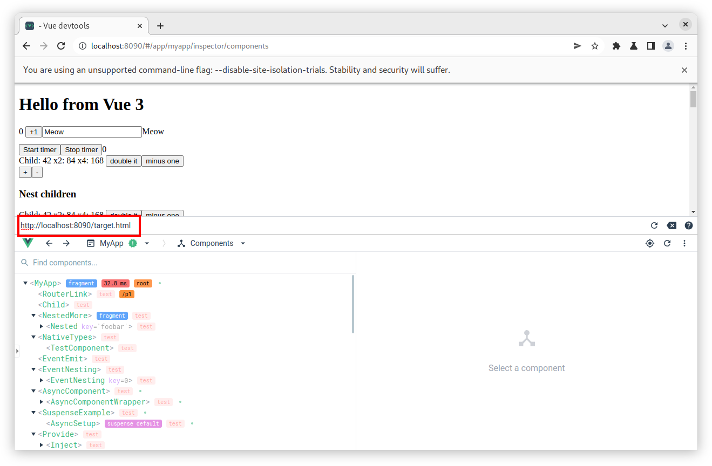
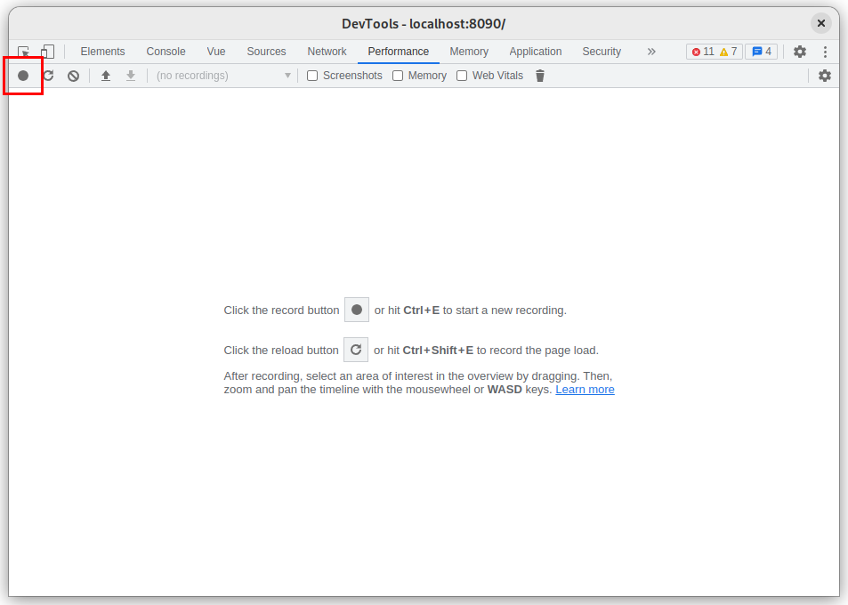
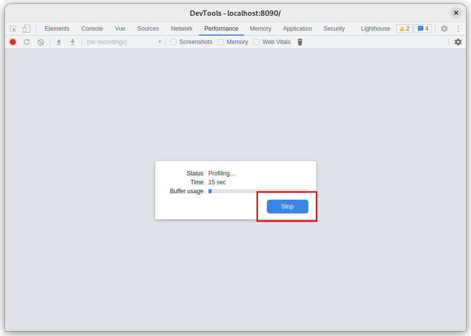
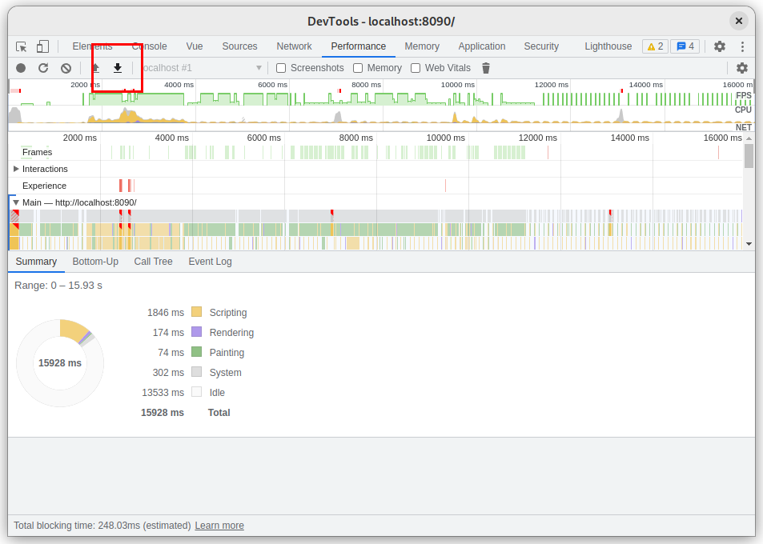
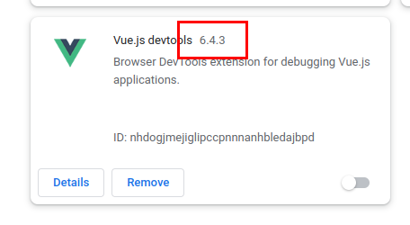

# Profiling devtools performance

If you experience performance issues while using the devtools, this guide will explain how to profile the devtools and share the result to the team.

## 1. Setup environment

First you need to clone and setup the devtools repository as [explained in the contributing guide](./contributing.md#development).

## 2. Run Chrome with web security disabled

The development shell for the devtools is a page with a development version of the devtools and an iframe mimicking the page being inspected.

Normally inspecting the iframe would only work on the same domain (here `localhost`), but we can workaround this limitation by disabling web security in Chrome.

```bash
/path/to/chrome --disable-web-security --disable-site-isolation-trials --user-data-dir="temp-chrome-data"
```

::: danger
Do not browse to any other website while using this Chrome instance, as it will disable some security features.
:::

## 3. Open dev shell

Make sure you have run both the `build:watch` and the `dev:vue3` scripts as [explained in the contributing guide](./contributing.md#development).

In the Chrome window, open the devtools development shell at `http://localhost:8090`.

You can then change the target URL in the toolbar on top of the devtools:



## 4. Create a profiling session

Open the Chrome devtools and go to the Performance tab.

Start a performance recording by clicking the record button:



Then try to reproduce the performance issues by using your application and the devtools for 10 or 20 seconds.

## 5. Export the profiling data

When your are done, stop the recording by clicking the stop button:



Then click the "Save profile..." button to export the profiling data:



## 6. Share the profiling data

Check your Vue devtools version number in the Extensions tab of Chrome:



Post a new comment [here](https://github.com/vuejs/devtools/discussions/1968) with the following information:

- Run `npx envinfo --system --browsers` and paste the result. Make sure is contains your OS version and Chrome version.
- Vue Devtools version.
- Upadload the profiling data file in the comment (you can drag and drop it in the comment box).

Example:

```
  System:
    OS: Linux 5.19 Fedora Linux 36 (Workstation Edition)
    CPU: (24) x64 AMD Ryzen 9 3900XT 12-Core Processor
    Memory: 34.66 GB / 62.71 GB
    Container: Yes
    Shell: 5.1.16 - /bin/bash
  Browsers:
    Chrome: 106.0.5249.103
    Firefox: 105.0.1

  Vue Devtools version: 6.4.3

  (Don't forget to upload the profile data file!)
```

Thank you for your contribution!
