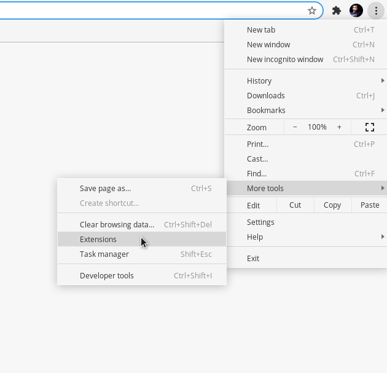
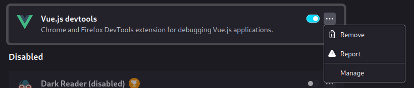
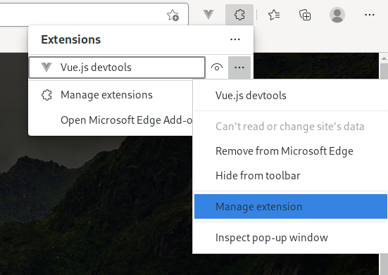
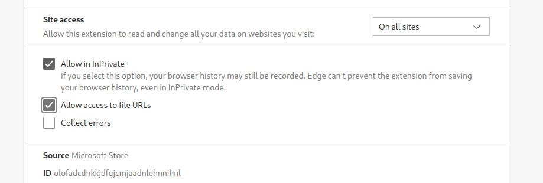

<script setup>
import InstallButtons from '../components/InstallButtons.vue'
import InstallButton from '../components/InstallButton.vue'
</script>

# Installation

::: tip Previous version
If you want to install the previous version of the devtools (v5), see [here](#legacy).
:::

<InstallButtons/>

## Chrome

Install the extension on the Chrome Web Store:

<InstallButton
  label="Install on Chrome"
  logo="/logo-chrome.svg"
  href="https://chrome.google.com/webstore/detail/vuejs-devtools/nhdogjmejiglipccpnnnanhbledajbpd"
  external
/>

### Beta

To install the beta version of the devtools, remove or disable any existing versions and install the extension from [here](https://chrome.google.com/webstore/detail/vuejs-devtools/ljjemllljcmogpfapbkkighbhhppjdbg).

<InstallButton
  label="Install Beta version on Chrome"
  logo="/logo-chrome.svg"
  href="https://chrome.google.com/webstore/detail/vuejs-devtools/ljjemllljcmogpfapbkkighbhhppjdbg"
  external
/>

### Settings

If you need to use the devtools in incognito mode or when you open an HTML file directly, you need to change the extension settings.

1. Go to the extensions:



2. Click on the `Details` button on the Vue.js Devtools extension.

3. Make sure the relevant settings are set:


## Firefox

Install the extension on the Mozilla Addons website:

<InstallButton
  label="Install on Firefox"
  logo="/logo-firefox.svg"
  href="https://addons.mozilla.org/en-US/firefox/addon/vue-js-devtools/"
  external
/>

### Beta

To install or update the beta version of the devtools, remove or disable any existing versions, go to one of repository beta releases and download the `xpi` file.

<InstallButton
  label="Install Beta version from Repository"
  logo="/logo-firefox.svg"
  href="https://github.com/vuejs/vue-devtools/releases"
  external
/>

### Settings

If you need to use the devtools in incognito mode, you need to change the extension settings.

1. Open **Menu** and click **Add-ons and Themes**


2. Click on **Manage** Option on **Vue.js devtools** Extension Options



3. Make sure the relevant settings are set:


## Edge

Install the extension on the Edge Store:

<InstallButton
  label="Install on Edge"
  logo="/logo-edge.png"
  href="https://microsoftedge.microsoft.com/addons/detail/vuejs-devtools/olofadcdnkkjdfgjcmjaadnlehnnihnl"
  external
/>

### Settings

If you need to use the devtools in InPrivate mode or when you open an HTML file directly, you need to change the extension settings.

1. Go to the extension page:



2. Make sure the relevant settings are set:



## Standalone

In case you are using an unsupported browser, or if you have other specific needs (for example your application is in Electron), you can use the standalone application.

Install the package globally:
```bash
npm install -g @vue/devtools
```

Or locally as project dependency:
```bash
npm install --save-dev @vue/devtools
```

### Using global package

Once you installed the package globally, run:
```bash
vue-devtools
```

Then add this code to the `<head>` section of your application HTML file:
```html
<script src="http://localhost:8098"></script>
```

Or if you want to debug your device remotely:
```html
<script>
  window.__VUE_DEVTOOLS_HOST__ = '<your-local-ip>' // default: localhost
  window.__VUE_DEVTOOLS_PORT__ = '<devtools-port>' // default: 8098
</script>
<script src="http://<your-local-ip>:8098"></script>
```

**(Don't forget to remove it before deploying to production!)**

`<your-local-ip>` usually looks like this: `192.168.x.x`.

Then start your development server like you are used to, *without* killing the `vue-devtools` command (for example, open a new terminal). Both need to run in parallel.

```bash
yarn dev
#or
yarn serve
```

### Using dependency package

Once you installed the package as project dependency, run:
```bash
./node_modules/.bin/vue-devtools
```

You can also use the global `vue-devtools` to start the app, but you might want to check if the local version matches the global one in this scenario to avoid any incompatibilities.

Then import it directly in your app:
```js
import devtools from '@vue/devtools'
// import Vue from 'vue'
```
> Make sure you import devtools before Vue, otherwise it might not work as expected.

And connect to host:
```js
if (process.env.NODE_ENV === 'development') {
  devtools.connect(/* host, port */)
}
```

**host** - is an optional argument that tells your application where devtools middleware server is running, if you debug your app on your computer you don't have to set this (the default is `http://localhost`), but if you want to debug your app on mobile devices, you might want to pass your local IP (e.g. `http://192.168.1.12`).

**port** - is an optional argument that tells your application on what port devtools middleware server is running. If you use proxy server, you might want to set it to `null` so the port won't be added to connection URL.

[More details](https://github.com/vuejs/devtools/tree/main/packages/shell-electron#vue-remote-devtools)

## Legacy

If something is broken with the new devtools, please [submit a new issue](https://github.com/vuejs/devtools/issues/new/choose)!

Meanwhile, you can install the legacy version (v5) of the devtools:

<div class="flex flex-col gap-2">
  <InstallButton
    label="Install Legacy version on Chrome"
    logo="/logo-chrome.svg"
    href="https://chrome.google.com/webstore/detail/iaajmlceplecbljialhhkmedjlpdblhp"
    external
  />

  <InstallButton
    label="Install Legacy version on Firefox"
    logo="/logo-firefox.svg"
    href="https://github.com/vuejs/vue-devtools/releases/download/v5.3.3/vuejs_devtools-5.3.4-fx.xpi"
    external
  />
</div>

Make sure you disable any other versions of the Vue devtools. Only one version should be enabled at a time.
